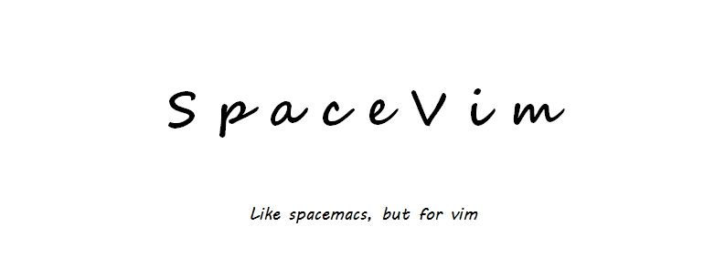

[](https://spacevim.org/cn/)

[](https://gitter.im/SpaceVim/cn)
[](https://travis-ci.org/SpaceVim/SpaceVim)
[](https://ci.appveyor.com/project/wsdjeg/spacevim/branch/master)
[](https://codecov.io/gh/SpaceVim/SpaceVim/branch/master)
[](https://github.com/SpaceVim/SpaceVim/releases)
[](https://github.com/SpaceVim/SpaceVim/blob/master/LICENSE)

SpaceVim 是一个社区驱动的模块化 Vim/Neovim 配置集合，以模块的方式组织管理插件以
及相关配置，为不同的语言开发量身定制了相关的开发模块，该模块提供代码自动补全，
语法检查、格式化、调试、REPL 等特性。用户仅需载入相关语言的模块即可得到一个开箱
即用的 Vim-IDE。

官网：<https://spacevim.org/cn/>

Github: <https://github.com/SpaceVim/SpaceVim>

码云：<https://gitee.com/SpaceVim/SpaceVim>


推荐阅读：

- [入门指南](https://spacevim.org/cn/quick-start-guide)
- [用户文档](https://spacevim.org/cn/documentation)
- [可用模块](https://spacevim.org/cn/layers)

<!-- vim-markdown-toc GFM -->

- [最新特性](#最新特性)
  - [多光标 Iedit 模式](#多光标-iedit-模式)
  - [高亮光标下的函数](#高亮光标下的函数)
  - [实时代码检索](#实时代码检索)
  - [快捷键辅助导航](#快捷键辅助导航)
  - [快捷键描述系统](#快捷键描述系统)
  - [异步插件管理器](#异步插件管理器)
- [安装](#安装)
  - [Linux 或 macOS](#linux-或-macos)
  - [Windows](#windows)
- [捐助 SpaceVim](#捐助-spacevim)

<!-- vim-markdown-toc -->

## 最新特性

以下为 SpaceVim 中最新实现的一些特性：

### 多光标 Iedit 模式

SpaceVim 内置了一种特殊的模式，Iedit 模式，这种模式提供了多光标支持，不同于已有插件的实现，
该模式支持两种状态：`iedit-Normal` 和 `iedit-Insert`。默认情况下，多光标输入时，`iedit-normal`
模式状态栏时是红色，而 `iedit-insert` 模式时是绿色，当然这由所选择的主题决定。


### 高亮光标下的函数

SpaceVim 支持高亮当前光标函数，并且启动一个特殊模式，在该模式下可以快捷地切换高亮区域
（方法内、屏幕内、整个文件内），并且可以快速在高亮函数间跳转、切换高亮状态（高亮、取消高亮），
并且可以根据已选择的位置进入 Iedit 模式。


### 实时代码检索

SpaceVim 自带的 FlyGrep 这个插件可以根据输入实时搜索项目代码，当然需要借助后台搜索工具，
目前支持的工具有：`ag`, `rg`, `ack`, `pt` 和 `grep`，用户可任意选择一个喜欢的工具。


### 快捷键辅助导航

在 SpaceVim 中，所有快捷键都有导航系统，你不需要记忆任何快捷键。初次使用时可根据快捷键提示进行操作。当按下空格键或者
`g`、`z` 以及 `s` 按键时，导航就会自动出现。当你记住了快捷键，输入比较快时，导航则不会出现。


### 快捷键描述系统

通过快捷键描述系统，你可以清楚的了解到一个快捷键的功能，并且可以快速跳转到快捷键定义的位置；
比如，通过 `SPC h d k` 启动快捷键描述系统，然后按下所需描述快捷键 `SPC b n`，就会弹出一个描述
窗口，在改窗口可以通过快捷键 `gd` 快速跳转到快捷键定义处。


### 异步插件管理器

SpaceVim 利用了 Vim 8 和 Neovim 最新的异步机制，实现了异步插件下载及更新，而插件运行管理采用的是 [dein.vim](https://github.com/Shougo/dein.vim/)。


想要获取更多关于 SpaceVim 的最新特性，请关注 [SpaceVim 官方博客](https://spacevim.org/blog/)

## 安装

### Linux 或 macOS

```bash
curl -sLf https://spacevim.org/cn/install.sh | bash
```

安装结束后，初次打开 `Vim` 或者 `gVim` 时，SpaceVim 会**自动**下载并安装插件。

如果需要获取安装脚本的帮助信息，可以执行如下命令，包括定制安装、更新和卸载等。

```bash
curl -sLf https://spacevim.org/cn/install.sh | bash -s -- -h
```

### Windows

Windows 下最快捷的安装方法是下载安装脚本 [install.cmd](https://spacevim.org/cn/install.cmd) 并运行。

## 捐助 SpaceVim

| 微信                                                     | 支付宝                                                     |
| -------------------------------------------------------- | ---------------------------------------------------------- |
|  |  |
