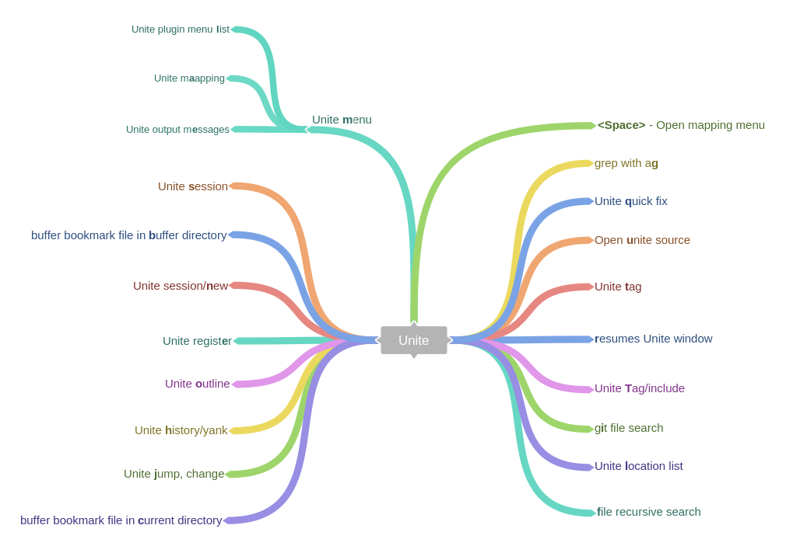

[](https://spacevim.org)

[Wiki](https://github.com/SpaceVim/SpaceVim/wiki) |
[Documentation](http://spacevim.org/documentation/) |
[Twitter](https://twitter.com/SpaceVim) |
[Community](https://spacevim.org/community/) |
[Gitter **Chat**](https://gitter.im/SpaceVim/SpaceVim)

[](https://travis-ci.org/SpaceVim/SpaceVim)

[](LICENSE)
[](doc/SpaceVim.txt)
[](http://isitmaintained.com/project/SpaceVim/SpaceVim "Average time to resolve an issue")
[](http://isitmaintained.com/project/SpaceVim/SpaceVim "Percentage of issues still open")

SpaceVim is a community-driven vim distribution that seeks to provide layer feature, especially for neovim. It offers a variety of layers to choose from. to create a suitable vim development environment, you just need to select the required layers.

See the [documentation](https://spacevim.org/documentation) or [the list of layers](http://spacevim.org/layers/) for more information.

Here is a throughput graph of the repository for the last few weeks:

[](https://waffle.io/SpaceVim/SpaceVim/metrics/throughput)

# Table of Contents


<!-- vim-markdown-toc GFM -->
* [Introduction](#introduction)
* [Features](#features)
    * [Mnemonic key bindings](#mnemonic-key-bindings)
    * [Unite work flow](#unite-work-flow)
    * [module statusline](#module-statusline)
* [Documentation](#documentation)
    * [Quick start guide](#quick-start-guide)
* [Getting Help](#getting-help)
* [Community](#community)
* [Install](#install)
    * [Linux/Mac](#linuxmac)
    * [windows support](#windows-support)
* [Update](#update)
* [Support SpaceVim](#support-spacevim)
    * [contribute to SpaceVim](#contribute-to-spacevim)
    * [Write post about SpaceVim](#write-post-about-spacevim)
* [Credits & Thanks](#credits--thanks)

<!-- vim-markdown-toc -->

## Introduction

[SpaceVim](https://github.com/SpaceVim/SpaceVim) is a community-driven vim distribution with a bundle of modular configuration,
here we call these modules as layers, each layer has different plugins and config, users just need
to select the layers they need. It got inspired by [spacemacs](https://github.com/syl20bnr/spacemacs). If you use SpaceVim,
please star it on github. It's a great way of getting feedback and gives me the kick to
put more time into development.


If you are new to vim, you should learn about Vim in general, read [vim-galore](https://github.com/mhinz/vim-galore).

## Features

- **Great documentation:** access documentation in Vim with
    <kbd>:h SpaceVim</kbd>.
- **Beautiful GUI:** you'll love the awesome UI and its useful features.
- **Mnemonic key bindings:** commands have mnemonic prefixes like
    <kbd>[Window]</kbd> for all the window and buffer commands or <kbd>[Unite]</kbd> for the
    unite work flow commands.
- **Lazy load plugins:** Lazy-load 90% of plugins with [dein.vim]
- **Batteries included:** discover hundreds of ready-to-use packages nicely
    organised in configuration layers following a set of
    [conventions](http://spacevim.org/development/).
- **Neovim centric:** Dark powered mode of SpaceVim

### Mnemonic key bindings

By default the guide buffer will be displayed 1000ms after the key has been pressed. You can change the delay by setting `'timeoutlen'` option to your liking (the value is in milliseconds).

for example, after pressing `<Space>` in normal mode, you will see :


this guide show you all the available key bindings begin with `[SPC]`, you can type `b` for all the buffer mappings, `p` for project mappings, etc. after pressing `<C-h>` in guide buffer, you will get paging and help info in the statusline.

here is the guide for the default mappings in SpaceVim:


### Unite work flow



### module statusline

The `core#statusline` layer provide a heavily customized powerline with the following capabilities:, It is inspired by spacemacs's mode-line. and this layer is loaded by default.

- show the window number
- color code for current state
- show the number of search results
- toggle syntax checking info
- toggle battery info
- toggle minor mode lighters


## Documentation

### Quick start guide

SpaceVim load custom configuration from `~/.SpaceVim.d/init.vim`,

:warning: It is not `~/.SpaceVim/init.vim`, user should not change anything in `~/.SpaceVim/`.

here is an example:

```vim
" Here are some basic customizations, please refer to the ~/.SpaceVim.d/init.vim
" file for all possible options:
let g:spacevim_default_indent = 3
let g:spacevim_max_column     = 80

" Change the default directory where all miscellaneous persistent files go.
" By default it is ~/.cache/vimfiles/.
let g:spacevim_plugin_bundle_dir = '~/.cache/vimfiles/'

" set SpaceVim colorscheme
let g:spacevim_colorscheme = 'gruvbox'

" Set plugin manager, you want to use, default is dein.vim
let g:spacevim_plugin_manager = 'dein'  " neobundle or dein or vim-plug

" Set windows shortcut leader [Window], default is `s`
let g:spacevim_windows_leader = 's'

" Set unite work flow shortcut leader [Unite], default is `f`
let g:spacevim_unite_leader = 'f'

" Set Denite work flow shortcut leader [Denite], default is `F`
let g:spacevim_denite_leader = 'F'

" By default, language specific plugins are not loaded. This can be changed
" with the following, then the plugins for go development will be loaded.
call SpaceVim#layers#load('lang#go')

" loaded ui layer
call SpaceVim#layers#load('ui')

" If there is a particular plugin you don't like, you can define this
" variable to disable them entirely:
let g:spacevim_disabled_plugins=[
    \ ['junegunn/fzf.vim'],
    \ ]

" If you want to add some custom plugins, use these options:
let g:spacevim_custom_plugins = [
    \ ['plasticboy/vim-markdown', {'on_ft' : 'markdown'}],
    \ ['wsdjeg/GitHub.vim'],
    \ ]

" set the guifont
let g:spacevim_guifont = 'DejaVu\ Sans\ Mono\ for\ Powerline\ 11'
```

Comprehensive documentation is available for each layer by <kbd>:h SpaceVim</kbd>.

You can also check the [general documentation](http://spacevim.org/documentation/).

## Getting Help

If you need help, ask your question in the [Gitter Chat](https://gitter.im/SpaceVim/SpaceVim), a member of the community will help you out.

## Community
Try these Neovim hangouts for any questions, problems or comments.
- Ask
    - [issue tracker](https://github.com/SpaceVim/SpaceVim/issues) for issue and feature requests
    - vi StackExchange for "how to" & configuration questions
    - [](https://twitter.com/SpaceVim) for hugs & pithy comments
- Chat
    - [](https://gitter.im/SpaceVim/SpaceVim?utm_source=badge&utm_medium=badge&utm_campaign=pr-badge)
    - [](https://jq.qq.com/?_wv=1027&k=43DB6SG)
    - [](https://www.facebook.com/SpaceVim)
- Discuss
    - [google mailing list](https://groups.google.com/forum/#!forum/spacevim)

## Install

### Linux/Mac

**Install SpaceVim with the command below**

```bash
curl -sLf https://spacevim.org/install.sh | bash
```

**After SpaceVim is installed, launch `vim` and SpaceVim will automatically install plugins**


SpaceVim required Vim7.4 above or neovim, here is the installation of neovim/vim with python support:

- [neovim installation](https://github.com/neovim/neovim/wiki/Installing-Neovim)

- [Building Vim from source](https://github.com/Valloric/YouCompleteMe/wiki/Building-Vim-from-source)

for more info about the install script, please check:

```bash
curl -sLf https://spacevim.org/install.sh | bash -s -- -h
```

### windows support

- For vim in windows, please just clone this repo as vimfiles in you Home directory.
by default, when open a cmd, the current dir is your Home directory, run this command in cmd.
make sure you have a backup of your own vimfiles. also you need remove `~/_vimrc` in your home directory.

```sh
git clone https://github.com/SpaceVim/SpaceVim.git vimfiles
```

- For neovim in windows, please clone this repo as `AppData\Local\nvim` in your home directory.
for more info, please check out [neovim's wiki](https://github.com/neovim/neovim/wiki/Installing-Neovim).
by default, when open a cmd, the current dir is your Home directory, run this command in cmd.

```bash
git clone https://github.com/SpaceVim/SpaceVim.git AppData\Local\nvim
```

## Update

you can update SpaceVim with the command below:

```viml
:SPUpdate SpaceVim
```

## Support SpaceVim

The best way to support SpaceVim is to contribute to it either by reporting bugs, helping the community on the Gitter Chat or sending pull requests.

If you want to show your support financially you can contribute to [Bountysource](https://www.bountysource.com/teams/spacevim) or buy a drink for the maintainer by clicking following icon.

<a href='https://ko-fi.com/A538L6H' target='_blank'></a>

If you used SpaceVim in a project and you want to show that fact, you can use the SpaceVim badge:

[](https://spacevim.org)

markdown

```md
[](https://spacevim.org)
```

### contribute to SpaceVim

Before contributing be sure to consult the [contribution guidelines](http://spacevim.org/development/#contribution-guidelines) and [conventions](http://spacevim.org/development/#conventions).

### Write post about SpaceVim

if you want to write something about SpaceVim, and want your post be linked in [SpaceVim's blog page](https://spacevim.org/blog), please show us the link.


## Credits & Thanks
- [](https://github.com/SpaceVim/SpaceVim/graphs/contributors)
- [vimdoc](https://github.com/google/vimdoc) generate doc file for SpaceVim
- [Rafael Bodill](https://github.com/rafi) and his vim-config
- [Bailey Ling](https://github.com/bling) and his dotvim
