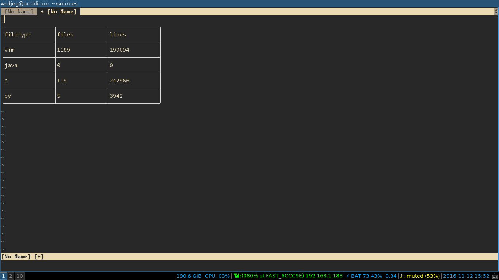

# SourceCounter.vim

> source counter in vim

### Useage

- `:SourceCounter` : Display result in cmdline
- `:SourceCounter!` : Display result in new tab

### Options

- `g:source_counter_sort` : sort method of result, by default, it is `files`, and if you want to sort by lines, use `let g:source_counter_sort = 'lines'`

### Screenshot

