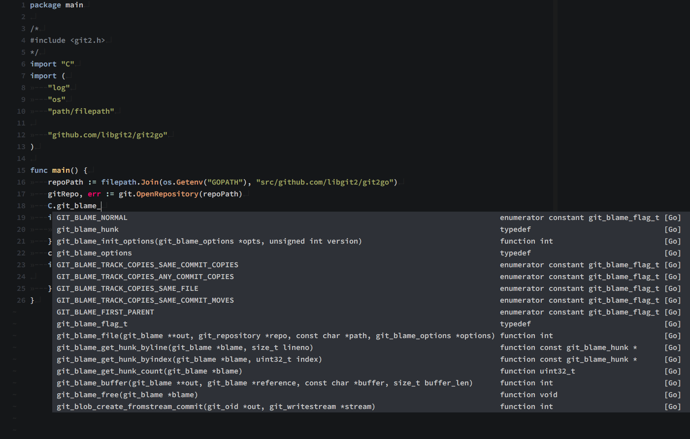

# deoplete-go

|| **Status** |
|:---:|:---:|
| **Travis CI** |[](https://travis-ci.org/zchee/deoplete-go)|
| **Gitter** |[](https://gitter.im/zchee/deoplete-go?utm_source=badge&utm_medium=badge&utm_campaign=pr-badge&utm_content=badge)|

Go source for [deoplete.nvim](https://github.com/Shougo/deoplete.nvim) use [gocode](https://github.com/stamblerre/gocode).

## Overview
Asynchronous Go completion for Neovim/Vim8.
Use,

### deoplete.nvim
[Shougo/deoplete.nvim](https://github.com/Shougo/deoplete.nvim)

Dark powered asynchronous completion framework for neovim/Vim8.
Fastetst, Fully asynchronous, Nonblocking user interface, Customizable source
for each languages, and more.  The Nextgen word completion.

### gocode
[stamblerre/gocode](https://github.com/stamblerre/gocode)

An autocompletion daemon for the Go programming language.
Fastest, Context-sensitive, Server/Client architecture, Result caching.
The *de facto* standard completion engine.

---

## Required

### deoplete.nvim
https://github.com/Shougo/deoplete.nvim

### gocode
https://github.com/stamblerre/gocode

---

## How to install

### 1. Install Neovim or Vim8
For neovim, see Neovim wiki.

- [Installing Neovim](https://github.com/neovim/neovim/wiki/Installing-Neovim)
- [Following HEAD](https://github.com/neovim/neovim/wiki/Following-HEAD)
- [Building](https://github.com/neovim/neovim/wiki/Building-Neovim)

### 2. Install deoplete
See https://github.com/Shougo/deoplete.nvim

### 3. Install latest of gocode

```bash
go get -u github.com/stamblerre/gocode
```

### 4. Install plugin and Build ujson module
`deoplete-go` using [esnme/ultrajson](https://github.com/esnme/ultrajson) json module.
It's Python bindings for C library. Need compiling.
So, If you use Plugin manager supported build process, set `make` commmand.

```vim
" dein.vim
call dein#add('Shougo/deoplete.nvim')
call dein#add('deoplete-plugins/deoplete-go', {'build': 'make'})

" NeoBundle
NeoBundle 'Shougo/deoplete.nvim'
NeoBundle 'deoplete-plugins/deoplete-go', {'build': {'unix': 'make'}}

" vim-plug
Plug 'Shougo/deoplete.nvim'
Plug 'deoplete-plugins/deoplete-go', { 'do': 'make'}
```

---

## Available Settings

| Setting value                               | Default | Required      |
|:---------------------------------------:    |:-------:|:-------------:|
| `g:deoplete#sources#go#gocode_binary`       | `''`    | **Recommend** |
| `g:deoplete#sources#go#package_dot`         | `0`     | No            |
| `g:deoplete#sources#go#sort_class`          | `[]`    | **Recommend** |
| `g:deoplete#sources#go#cgo`                 | `0`     | *Any*         |
| `g:deoplete#sources#go#goos`                | `''`    | No            |
| `g:deoplete#sources#go#source_importer`     | `0`     | No            |
| `g:deoplete#sources#go#builtin_objects`     | `0`     | No            |
| `g:deoplete#sources#go#unimported_packages` | `0`     | No            |
| `g:deoplete#sources#go#fallback_to_source ` | `0`     | No            |

### `g:deoplete#sources#go#gocode_binary`
#### `gocode` Binary

| **Default**  | `''`                    |
|--------------|-------------------------|
| **Required** | **Recommend**           |
| **Type**     | string                  |
| **Example**  | `$GOPATH.'/bin/gocode'` |

`deoplete-go` will directly call `gocode`. Not vim bypass due to the omnifunc.
By default (not set), Find the gocode binary in `$PATH` environment.
This setting is **Recommend**.
If you set it, `deoplete-go` spared look for the binary. It will improve performance.

Also, If you want to use a different from the first found `gocode` binary from `$PATH` then set:
```vim
let g:deoplete#sources#go#gocode_binary = '/path/to/gocode'
```

### `g:deoplete#sources#go#package_dot`
#### Automatically insert dot after package name

| **Default**  | `0` |
|--------------|-----|
| **Required** | No  |
| **Type**     | int |
| **Example**  | `1` |

Automatically insert dot (period) when you select `package` name in popup menu.
By default, no dot (period) is inserted after a package name.

If you would prefer adding a period then set:
```vim
let g:deoplete#sources#go#package_dot = 1
```

### `g:deoplete#sources#go#sort_class`
#### Class Sorting and Ignore

| **Default**  | `[]`               |
|--------------|--------------------|
| **Required** | **Recommend**      |
| **Type**     | list               |
| **Example**  | See bellow exmaple |

By default, the completion word list is in the sort order of gocode. Same as
omnifunc.  If you want to change it to an arbitrary order, set it.

Available values are [`package`, `func`, `type`, `var`, `const`].
If you did not include any value, it will always be hidden in the completion
list.

To display all words while sorting, set:
```vim
let g:deoplete#sources#go#sort_class = ['package', 'func', 'type', 'var', 'const']
```

### `g:deoplete#sources#go#pointer`
#### Support pointer match

| **Default**  | `0`   |
|--------------|-------|
| **Required** | *Any* |
| **Type**     | int   |
| **Example**  | `1`   |

Support pointer (`*`) match.
Example are bellow code. `|` is cursor.

```go
type Foo struct {
  FooName string
}

func NewFoo() *Foo {
  return &Foo{}
}

func (f *|
```

### `g:deoplete#sources#go#cgo`
#### cgo complete use libclang-python3

| **Default**  | `0`   |
|--------------|-------|
| **Required** | *Any* |
| **Type**     | int   |
| **Example**  | `1`   |

If current buffer has `import "C"` also `#include <foo.h>` and when you type
`C.`, deoplete-go will display the C function in the `foo.h`.

Simple example is below. `|` is cursor.

```go
package main

/*
#include <stdlib.h>
*/
import "C"
import (
	"fmt"
)

func main() {
	fmt.Printf()
	C.|
}
```

Will return the `pid_t`, `malloc`, `free` and more.

The real example uses libgit2.

```go
package main

/*
#include <git2.h>
*/
import "C"
import (
	"log"
	"os"
	"path/filepath"

	"github.com/libgit2/git2go"
)

func main() {
	repoPath := filepath.Join(os.Getenv("GOPATH"), "src/github.com/libgit2/git2go")
	gitRepo, err := git.OpenRepository(repoPath)

	C.git_blame_|

	if err != nil {
		log.Fatal(err)
	}
	commitOid, err := gitRepo.Head()
	if err != nil {

	}
}
```

Will return that completion list.



Now support current buffer only.
TODO: Support parses `.c`, `.h` file.

### `g:deoplete#sources#go#cgo#libclang_path`
#### libclang shared library path for cgo complete

| **Default**  | ` `                            |
|--------------|--------------------------------|
| **Required** | *Any*                          |
| **Type**     | string                         |
| **Example**  | `/opt/llvm/lib/libclang.dylib` |

libclang shared library path option.
In darwin, `libclang.dylib`, In Linux, `libclang.so`.

### `g:deoplete#sources#go#cgo#std`
#### C language standard version

| **Default**  | `c11`  |
|--------------|--------|
| **Required** | *Any*  |
| **Type**     | string |
| **Example**  | `c99`  |

C language standard version option.
If not set, deoplete-go uses `c11`(latest) version.

### `g:deoplete#sources#go#auto_goos`
#### Automatically set GOOS environment variable when calling `gocode`

| **Default**  | `0`     |
|--------------|---------|
| **Required** | No      |
| **Type**     | boolean |
| **Example**  | `1`     |

When enabled, deoplete-go will try to set `GOOS` by checking the file name for
`name_<OS>.go`.  If not found, the file will be checked for a `// +build <OS>`
directive.  If the file's OS doesn't match your OS (e.g.  `file_darwin.go`
while on `linux`), `CGO_ENABLED=0` will also be set.

**Note:** There may be a 5-10 second delay if `gocode` needs to compile the
platform-specific sources for the first time.

### `g:deoplete#sources#go#source_importer`
#### Enable source importer

| **Default**  | `0` |
|--------------|-----|
| **Required** | No  |
| **Type**     | int |
| **Example**  | `1` |

When enabled, deoplete-go can complete external packages.

It is deprecated option.  You should use the latest gocode.
https://github.com/mdempsky/gocode/pull/71

### `g:deoplete#sources#go#builtin_objects`
#### Propose builtin objects

| **Default**  | `0` |
|--------------|-----|
| **Required** | No  |
| **Type**     | int |
| **Example**  | `1` |

When enabled, deoplete-go can complete builtin objects.

### `g:deoplete#sources#go#unimported_packages`
#### Propose completions for unimported standard library packages

| **Default**  | `0` |
|--------------|-----|
| **Required** | No  |
| **Type**     | int |
| **Example**  | `1` |

When enabled, deoplete-go can complete standard library packages that are
not explicitely imported yet.

### `g:deoplete#sources#go#fallback_to_source`
#### Scan source files when a dependency is not found on the GOPATH

| **Default**  | `0` |
|--------------|-----|
| **Required** | No  |
| **Type**     | int |
| **Example**  | `1` |

When enabled, deoplete-go will try the source importer when it fails
to find a dependency on the GOPATH.

---

## Sample init.vim

```vim
" neocomplete like
set completeopt+=noinsert
" deoplete.nvim recommend
set completeopt+=noselect

" Path to python interpreter for neovim
let g:python3_host_prog  = '/path/to/python3'
" Skip the check of neovim module
let g:python3_host_skip_check = 1

" Run deoplete.nvim automatically
let g:deoplete#enable_at_startup = 1
" deoplete-go settings
let g:deoplete#sources#go#gocode_binary = $GOPATH.'/bin/gocode'
let g:deoplete#sources#go#sort_class = ['package', 'func', 'type', 'var', 'const']
```

---

TODO:
-----
- [x] Parse included cgo (C, C++ language) headers on current buffer
  - `ctags` will be blocking `deoplete.nvim`
- [x] Support static json caching
  - See https://github.com/deoplete-plugins/deoplete-go/pull/19
- [x] Support Go stdlib package `import "***"` name completion
  - This feature has been implemented in gocode. Thanks @nhooyr!
- [x] Execute `gocode` binary instead of call vim function
- [x] Get and parse completion list of json format. such as `ycm`
- [x] When there is no candidate infomation, deoplete will cause an error
- [x] Support fizzy matching
