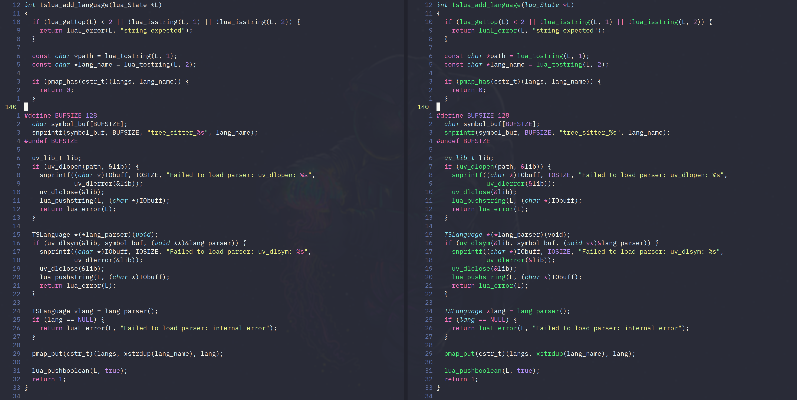

<div align="center">
  <h1>nvim-treesitter</h1>
  <p>
    <a href="https://nvim-treesitter.zulipchat.com/">
      
    </a>
    <a href="https://github.com/nvim-treesitter/nvim-treesitter/actions?query=workflow%3A%22Linting+and+style+checking%22+branch%3Amaster">
      
    </a>
    <a href="https://github.com/nvim-treesitter/nvim-treesitter/actions?query=workflow%3A%22Check+loading+of+syntax+files%22+branch%3Amaster">
      
    </a>
  </p>
</div>

<div align="center">
  <p>
    
  </p>
  <p>
    <a href="https://github.com/tree-sitter/tree-sitter">Treesitter</a>
    configurations and abstraction layer for
    <a href="https://github.com/neovim/neovim/">Neovim</a>.
  </p>
  <p>
    <i>
      Logo by <a href="https://github.com/steelsojka">@steelsojka</a>
    </i>
  </p>
</div>

The goal of `nvim-treesitter` is both to provide a simple and easy way to use the interface for [tree-sitter](https://github.com/tree-sitter/tree-sitter) in Neovim and to provide some basic functionality such as highlighting based on it:



Traditional highlighting (left) vs Treesitter-based highlighting (right).
More examples can be found in [our gallery](https://github.com/nvim-treesitter/nvim-treesitter/wiki/Gallery).

**Warning: Treesitter and nvim-treesitter highlighting are an experimental feature of Neovim.
Please consider the experience with this plug-in as experimental until Tree-Sitter support in Neovim is stable!
We recommend using the nightly builds of Neovim if possible.
You can find the current roadmap [here](https://github.com/nvim-treesitter/nvim-treesitter/projects/1).
The roadmap and all features of this plugin are open to change, and any suggestion will be highly appreciated!**

Nvim-treesitter is based on three interlocking features: [**language parsers**](#language-parsers), [**queries**](#adding-queries), and [**modules**](#available-modules), where *modules* provide features – e.g., highlighting – based on *queries* for syntax objects extracted from a given buffer by *language parsers*.
Users will generally only need to interact with parsers and modules as explained in the next section.
For more detailed information on setting these up, see ["Advanced setup"](#advanced-setup).

---

### Table of contents

* [Quickstart](#quickstart)
* [Supported languages](#supported-languages)
* [Available modules](#available-modules)
* [Advanced setup](#advanced-setup)
* [Extra features](#extra-features)
* [Troubleshooting](#troubleshooting)

---

# Quickstart

## Requirements

- Neovim latest stable version or [nightly](https://github.com/neovim/neovim#install-from-source)
- `tar` and `curl` in your path (or alternatively `git`)
- A C compiler in your path and libstdc++ installed ([Windows users please read this!](https://github.com/nvim-treesitter/nvim-treesitter/wiki/Windows-support)).

## Installation

You can install `nvim-treesitter` with your favorite package manager (or using the native `package` feature of vim, see `:h packages`).

**NOTE: This plugin is only guaranteed to work with specific versions of language parsers** (as specified in the `lockfile.json`). **When upgrading the plugin, you must make sure that all installed parsers are updated to the latest version** via `:TSUpdate`.
It is strongly recommended to automate this; e.g., if you are using [vim-plug](https://github.com/junegunn/vim-plug), put this in your `init.vim` file:

```vim
Plug 'nvim-treesitter/nvim-treesitter', {'do': ':TSUpdate'}
```

For other plugin managers such as `packer.nvim`, see this [Installation page from the wiki](https://github.com/nvim-treesitter/nvim-treesitter/wiki/Installation) (Note that this page is community maintained).

## Language parsers

Treesitter uses a different _parser_ for every language, which needs to be generated via `tree-sitter-cli` from a `grammar.js` file, then compiled to a `.so` library that needs to be placed in neovim's `runtimepath` (typically under `parser/{language}.so`).
To simplify this, `nvim-treesitter` provides commands to automate this process.
If the language is already [supported by `nvim-treesitter`](#supported-languages), you can install it with
```vim
:TSInstall <language_to_install>
```
This command supports tab expansion.
You can also get a list of all available languages and their installation status with `:TSInstallInfo`.
Parsers not on this list can be added manually by following the steps described under ["Adding parsers"](#adding-parsers) below.

To make sure a parser is at the latest compatible version (as specified in `nvim-treesitter`'s `lockfile.json`), use `:TSUpdate {language}`. To update all parsers unconditionally, use `:TSUpdate all` or just `:TSUpdate`.

## Modules

Each module provides a distinct tree-sitter-based feature such as [highlighting](#highlight), [indentation](#indentation), or [folding](#folding); see [`:h nvim-treesitter-modules`](doc/nvim-treesitter.txt) or ["Available modules"](#available-modules) below for a list of modules and their options.

Following examples assume that you are configuring neovim with lua. If you are using vimscript, see `:help lua-heredoc`.
All modules are disabled by default and need to be activated explicitly in your `init.lua`, e.g., via

```lua
require'nvim-treesitter.configs'.setup {
  -- A list of parser names, or "all"
  ensure_installed = { "c", "lua", "rust" },

  -- Install parsers synchronously (only applied to `ensure_installed`)
  sync_install = false,

  -- List of parsers to ignore installing (for "all")
  ignore_install = { "javascript" },

  highlight = {
    -- `false` will disable the whole extension
    enable = true,

    -- NOTE: these are the names of the parsers and not the filetype. (for example if you want to
    disable highlighting for the `tex` filetype, you need to include `latex` in this list as this is
    the name of the parser)
    -- list of language that will be disabled
    disable = { "c", "rust" },

    -- Setting this to true will run `:h syntax` and tree-sitter at the same time.
    -- Set this to `true` if you depend on 'syntax' being enabled (like for indentation).
    -- Using this option may slow down your editor, and you may see some duplicate highlights.
    -- Instead of true it can also be a list of languages
    additional_vim_regex_highlighting = false,
  },
}
```

Each module can also be enabled or disabled interactively through the following commands:

```vim
:TSBufEnable {module} " enable module on current buffer
:TSBufDisable {module} " disable module on current buffer
:TSEnable {module} [{ft}] " enable module on every buffer. If filetype is specified, enable only for this filetype.
:TSDisable {module} [{ft}] " disable module on every buffer. If filetype is specified, disable only for this filetype.
:TSModuleInfo [{module}] " list information about modules state for each filetype
```

Check [`:h nvim-treesitter-commands`](doc/nvim-treesitter.txt) for a list of all available commands.
It may be necessary to reload the buffer (e.g., via `:e`) after enabling a module interactively.

# Supported languages

For `nvim-treesitter` to support a specific feature for a specific language requires both a parser for that language and an appropriate language-specific query file for that feature.

The following is a list of languages for which a parser can be installed through `:TSInstall`; a checked box means that `nvim-treesitter` also contains queries at least for the `highlight` module.

Experimental parsers are parsers that have a maintainer but are not stable enough for
daily use yet.

We are looking for maintainers to add more parsers and to write query files for their languages. Check our [tracking issue](https://github.com/nvim-treesitter/nvim-treesitter/issues/2282) for open language requests.

<!--This section of the README is automatically updated by a CI job-->
<!--parserinfo-->
- [x] [astro](https://github.com/virchau13/tree-sitter-astro) (maintained by @virchau13)
- [x] [bash](https://github.com/tree-sitter/tree-sitter-bash) (maintained by @TravonteD)
- [x] [beancount](https://github.com/polarmutex/tree-sitter-beancount) (maintained by @polarmutex)
- [x] [bibtex](https://github.com/latex-lsp/tree-sitter-bibtex) (maintained by @theHamsta, @clason)
- [x] [c](https://github.com/tree-sitter/tree-sitter-c) (maintained by @vigoux)
- [x] [c_sharp](https://github.com/tree-sitter/tree-sitter-c-sharp) (maintained by @Luxed)
- [x] [clojure](https://github.com/sogaiu/tree-sitter-clojure) (maintained by @sogaiu)
- [x] [cmake](https://github.com/uyha/tree-sitter-cmake) (maintained by @uyha)
- [x] [comment](https://github.com/stsewd/tree-sitter-comment) (maintained by @stsewd)
- [x] [commonlisp](https://github.com/theHamsta/tree-sitter-commonlisp) (maintained by @theHamsta)
- [x] [cooklang](https://github.com/addcninblue/tree-sitter-cooklang) (maintained by @addcninblue)
- [x] [cpp](https://github.com/tree-sitter/tree-sitter-cpp) (maintained by @theHamsta)
- [x] [css](https://github.com/tree-sitter/tree-sitter-css) (maintained by @TravonteD)
- [x] [cuda](https://github.com/theHamsta/tree-sitter-cuda) (maintained by @theHamsta)
- [x] [d](https://github.com/CyberShadow/tree-sitter-d) (experimental, maintained by @nawordar)
- [x] [dart](https://github.com/UserNobody14/tree-sitter-dart) (maintained by @Akin909)
- [x] [devicetree](https://github.com/joelspadin/tree-sitter-devicetree) (maintained by @jedrzejboczar)
- [x] [dockerfile](https://github.com/camdencheek/tree-sitter-dockerfile) (maintained by @camdencheek)
- [x] [dot](https://github.com/rydesun/tree-sitter-dot) (maintained by @rydesun)
- [x] [eex](https://github.com/connorlay/tree-sitter-eex) (maintained by @connorlay)
- [x] [elixir](https://github.com/elixir-lang/tree-sitter-elixir) (maintained by @jonatanklosko, @connorlay)
- [ ] [elm](https://github.com/elm-tooling/tree-sitter-elm)
- [x] [elvish](https://github.com/ckafi/tree-sitter-elvish) (maintained by @ckafi)
- [x] [erlang](https://github.com/AbstractMachinesLab/tree-sitter-erlang) (maintained by @ostera)
- [x] [fennel](https://github.com/travonted/tree-sitter-fennel) (maintained by @TravonteD)
- [x] [fish](https://github.com/ram02z/tree-sitter-fish) (maintained by @ram02z)
- [x] [foam](https://github.com/FoamScience/tree-sitter-foam) (experimental, maintained by @FoamScience)
- [ ] [fortran](https://github.com/stadelmanma/tree-sitter-fortran)
- [x] [fusion](https://gitlab.com/jirgn/tree-sitter-fusion.git) (maintained by @jirgn)
- [x] [Godot (gdscript)](https://github.com/PrestonKnopp/tree-sitter-gdscript) (maintained by @Shatur95)
- [x] [gleam](https://github.com/J3RN/tree-sitter-gleam) (maintained by @connorlay)
- [x] [Glimmer and Ember](https://github.com/alexlafroscia/tree-sitter-glimmer) (maintained by @alexlafroscia)
- [x] [glsl](https://github.com/theHamsta/tree-sitter-glsl) (maintained by @theHamsta)
- [x] [go](https://github.com/tree-sitter/tree-sitter-go) (maintained by @theHamsta, @WinWisely268)
- [x] [Godot Resources (gdresource)](https://github.com/PrestonKnopp/tree-sitter-godot-resource) (maintained by @pierpo)
- [x] [gomod](https://github.com/camdencheek/tree-sitter-go-mod) (maintained by @camdencheek)
- [x] [gowork](https://github.com/omertuc/tree-sitter-go-work) (maintained by @omertuc)
- [x] [graphql](https://github.com/bkegley/tree-sitter-graphql) (maintained by @bkegley)
- [ ] [hack](https://github.com/slackhq/tree-sitter-hack)
- [ ] [haskell](https://github.com/tree-sitter/tree-sitter-haskell)
- [x] [hcl](https://github.com/MichaHoffmann/tree-sitter-hcl) (maintained by @MichaHoffmann)
- [x] [heex](https://github.com/connorlay/tree-sitter-heex) (maintained by @connorlay)
- [x] [help](https://github.com/vigoux/tree-sitter-vimdoc) (experimental, maintained by @vigoux)
- [x] [hjson](https://github.com/winston0410/tree-sitter-hjson) (maintained by @winston0410)
- [x] [hocon](https://github.com/antosha417/tree-sitter-hocon) (maintained by @antosha417)
- [x] [html](https://github.com/tree-sitter/tree-sitter-html) (maintained by @TravonteD)
- [x] [http](https://github.com/NTBBloodbath/tree-sitter-http) (maintained by @NTBBloodbath)
- [x] [java](https://github.com/tree-sitter/tree-sitter-java) (maintained by @p00f)
- [x] [javascript](https://github.com/tree-sitter/tree-sitter-javascript) (maintained by @steelsojka)
- [x] [jsdoc](https://github.com/tree-sitter/tree-sitter-jsdoc) (maintained by @steelsojka)
- [x] [json](https://github.com/tree-sitter/tree-sitter-json) (maintained by @steelsojka)
- [x] [json5](https://github.com/Joakker/tree-sitter-json5) (maintained by @Joakker)
- [x] [JSON with comments](https://gitlab.com/WhyNotHugo/tree-sitter-jsonc.git) (maintained by @WhyNotHugo)
- [x] [julia](https://github.com/tree-sitter/tree-sitter-julia) (maintained by @mroavi, @theHamsta)
- [x] [kotlin](https://github.com/fwcd/tree-sitter-kotlin) (maintained by @SalBakraa)
- [x] [lalrpop](https://github.com/traxys/tree-sitter-lalrpop) (maintained by @traxys)
- [x] [latex](https://github.com/latex-lsp/tree-sitter-latex) (maintained by @theHamsta, @clason)
- [x] [ledger](https://github.com/cbarrete/tree-sitter-ledger) (maintained by @cbarrete)
- [x] [llvm](https://github.com/benwilliamgraham/tree-sitter-llvm) (maintained by @benwilliamgraham)
- [x] [lua](https://github.com/MunifTanjim/tree-sitter-lua) (maintained by @muniftanjim)
- [x] [make](https://github.com/alemuller/tree-sitter-make) (maintained by @lewis6991)
- [ ] [markdown](https://github.com/MDeiml/tree-sitter-markdown)
- [x] [ninja](https://github.com/alemuller/tree-sitter-ninja) (maintained by @alemuller)
- [x] [nix](https://github.com/cstrahan/tree-sitter-nix) (maintained by @leo60228)
- [x] [norg](https://github.com/nvim-neorg/tree-sitter-norg) (maintained by @JoeyGrajciar, @vhyrro, @mrossinek)
- [x] [ocaml](https://github.com/tree-sitter/tree-sitter-ocaml) (maintained by @undu)
- [x] [ocaml_interface](https://github.com/tree-sitter/tree-sitter-ocaml) (maintained by @undu)
- [x] [ocamllex](https://github.com/atom-ocaml/tree-sitter-ocamllex) (maintained by @undu)
- [x] [pascal](https://github.com/Isopod/tree-sitter-pascal.git) (maintained by @isopod)
- [x] [perl](https://github.com/ganezdragon/tree-sitter-perl) (maintained by @ganezdragon)
- [x] [php](https://github.com/tree-sitter/tree-sitter-php) (maintained by @tk-shirasaka)
- [x] [phpdoc](https://github.com/claytonrcarter/tree-sitter-phpdoc) (experimental, maintained by @mikehaertl)
- [x] [pioasm](https://github.com/leo60228/tree-sitter-pioasm) (maintained by @leo60228)
- [x] [prisma](https://github.com/victorhqc/tree-sitter-prisma) (maintained by @elianiva)
- [x] [pug](https://github.com/zealot128/tree-sitter-pug) (maintained by @zealot128)
- [x] [python](https://github.com/tree-sitter/tree-sitter-python) (maintained by @stsewd, @theHamsta)
- [x] [ql](https://github.com/tree-sitter/tree-sitter-ql) (maintained by @pwntester)
- [x] [Tree-sitter query language](https://github.com/nvim-treesitter/tree-sitter-query) (maintained by @steelsojka)
- [x] [r](https://github.com/r-lib/tree-sitter-r) (maintained by @jimhester)
- [x] [rasi](https://github.com/Fymyte/tree-sitter-rasi) (maintained by @Fymyte)
- [x] [regex](https://github.com/tree-sitter/tree-sitter-regex) (maintained by @theHamsta)
- [x] [rego](https://github.com/FallenAngel97/tree-sitter-rego) (maintained by @FallenAngel97)
- [x] [rst](https://github.com/stsewd/tree-sitter-rst) (maintained by @stsewd)
- [x] [ruby](https://github.com/tree-sitter/tree-sitter-ruby) (maintained by @TravonteD)
- [x] [rust](https://github.com/tree-sitter/tree-sitter-rust) (maintained by @vigoux)
- [x] [scala](https://github.com/tree-sitter/tree-sitter-scala) (maintained by @stevanmilic)
- [x] [scheme](https://github.com/6cdh/tree-sitter-scheme) (maintained by @6cdh)
- [x] [scss](https://github.com/serenadeai/tree-sitter-scss) (maintained by @elianiva)
- [x] [slint](https://github.com/jrmoulton/tree-sitter-slint) (experimental, maintained by @jrmoulton)
- [x] [solidity](https://github.com/YongJieYongJie/tree-sitter-solidity) (maintained by @YongJieYongJie)
- [x] [sparql](https://github.com/BonaBeavis/tree-sitter-sparql) (maintained by @bonabeavis)
- [x] [supercollider](https://github.com/madskjeldgaard/tree-sitter-supercollider) (maintained by @madskjeldgaard)
- [x] [surface](https://github.com/connorlay/tree-sitter-surface) (maintained by @connorlay)
- [x] [svelte](https://github.com/Himujjal/tree-sitter-svelte) (maintained by @elianiva)
- [ ] [swift](https://github.com/alex-pinkus/tree-sitter-swift)
- [x] [teal](https://github.com/euclidianAce/tree-sitter-teal) (maintained by @euclidianAce)
- [x] [tlaplus](https://github.com/tlaplus-community/tree-sitter-tlaplus) (maintained by @ahelwer, @susliko)
- [x] [todotxt](https://github.com/arnarg/tree-sitter-todotxt.git) (experimental, maintained by @arnarg)
- [x] [toml](https://github.com/ikatyang/tree-sitter-toml) (maintained by @tk-shirasaka)
- [x] [tsx](https://github.com/tree-sitter/tree-sitter-typescript) (maintained by @steelsojka)
- [x] [turtle](https://github.com/BonaBeavis/tree-sitter-turtle) (maintained by @bonabeavis)
- [x] [typescript](https://github.com/tree-sitter/tree-sitter-typescript) (maintained by @steelsojka)
- [x] [vala](https://github.com/matbme/tree-sitter-vala) (maintained by @matbme)
- [x] [verilog](https://github.com/tree-sitter/tree-sitter-verilog) (experimental, maintained by @zegervdv)
- [x] [vim](https://github.com/vigoux/tree-sitter-viml) (maintained by @vigoux)
- [x] [vue](https://github.com/ikatyang/tree-sitter-vue) (maintained by @WhyNotHugo)
- [x] [wgsl](https://github.com/szebniok/tree-sitter-wgsl) (maintained by @szebniok)
- [x] [yaml](https://github.com/ikatyang/tree-sitter-yaml) (maintained by @stsewd)
- [x] [yang](https://github.com/Hubro/tree-sitter-yang) (maintained by @Hubro)
- [x] [zig](https://github.com/maxxnino/tree-sitter-zig) (maintained by @maxxnino)
<!--parserinfo-->


# Available modules

Modules provide the top-level features of `nvim-treesitter`.
The following is a list of modules included in `nvim-treesitter` and their configuration via `init.lua` (where multiple modules can be combined in a single call to `setup`).
Note that not all modules work for all languages (depending on the queries available for them).
Additional modules can be provided as [external plugins](https://github.com/nvim-treesitter/nvim-treesitter/wiki/Extra-modules-and-plugins).

#### Highlight

Consistent syntax highlighting.

```lua
require'nvim-treesitter.configs'.setup {
  highlight = {
    enable = true,
    -- Setting this to true will run `:h syntax` and tree-sitter at the same time.
    -- Set this to `true` if you depend on 'syntax' being enabled (like for indentation).
    -- Using this option may slow down your editor, and you may see some duplicate highlights.
    -- Instead of true it can also be a list of languages
    additional_vim_regex_highlighting = false,
  },
}
```

You can add custom highlight captures with:

```vim
lua <<EOF
  require"nvim-treesitter.highlight".set_custom_captures {
    -- Highlight the @foo.bar capture group with the "Identifier" highlight group.
    ["foo.bar"] = "Identifier",
  }
EOF
```

#### Incremental selection

Incremental selection based on the named nodes from the grammar.

```lua
require'nvim-treesitter.configs'.setup {
  incremental_selection = {
    enable = true,
    keymaps = {
      init_selection = "gnn",
      node_incremental = "grn",
      scope_incremental = "grc",
      node_decremental = "grm",
    },
  },
}
```

#### Indentation

Indentation based on treesitter for the `=` operator.
**NOTE: This is an experimental feature**.

```lua
require'nvim-treesitter.configs'.setup {
  indent = {
    enable = true
  }
}
```

#### Folding

Tree-sitter based folding. *(Technically not a module because it's per windows and not per buffer.)*

```vim
set foldmethod=expr
set foldexpr=nvim_treesitter#foldexpr()
```

This will respect your `foldminlines` and `foldnestmax` settings.

# Advanced setup

## Adding parsers

If you have a parser that is not on the list of supported languages (either as a repository on Github or in a local directory), you can add it manually for use by `nvim-treesitter` as follows:

1. Clone the repository or [create a new project](https://tree-sitter.github.io/tree-sitter/creating-parsers#project-setup) in, say, `~/projects/tree-sitter-zimbu`. Make sure that the `tree-sitter-cli` executable is installed and in your path; see <https://tree-sitter.github.io/tree-sitter/creating-parsers#installation> for installation instructions.
2. Run `tree-sitter generate` in this directory (followed by `tree-sitter test` for good measure).
3. Add the following snippet to your `init.lua`:

```lua
local parser_config = require "nvim-treesitter.parsers".get_parser_configs()
parser_config.zimbu = {
  install_info = {
    url = "~/projects/tree-sitter-zimbu", -- local path or git repo
    files = {"src/parser.c"},
    -- optional entries:
    branch = "main", -- default branch in case of git repo if different from master
    generate_requires_npm = false, -- if stand-alone parser without npm dependencies
    requires_generate_from_grammar = false, -- if folder contains pre-generated src/parser.c
  },
  filetype = "zu", -- if filetype does not match the parser name
}
```

If you wish to set a specific parser for a filetype, you should extend the `filetype_to_parsername` table:

```lua
local ft_to_parser = require"nvim-treesitter.parsers".filetype_to_parsername
ft_to_parser.someft = "python" -- the someft filetype will use the python parser and queries.
```

4. Start `nvim` and `:TSInstall zimbu`.

You can also skip step 2 and use `:TSInstallFromGrammar zimbu` to install directly from a `grammar.js` in the top-level directory specified by `url`.
Once the parser is installed, you can update it (from the latest revision of the `main` branch if `url` is a Github repository) with `:TSUpdate zimbu`.

Note that neither `:TSInstall` nor `:TSInstallFromGrammar` copy query files from the grammar repository.
If you want your installed grammar to be useful, you must manually [add query files](#adding-queries) to your local nvim-treesitter installation.
Note also that module functionality is only triggered if your language's filetype is correctly identified.
If Neovim does not detect your language's filetype by default, you can use [Neovim's `vim.filetype.add()`](https://neovim.io/doc/user/lua.html#vim.filetype.add()) (0.7.0 and above) to add a custom detection rule.

If you use a git repository for your parser and want to use a specific version, you can set the `revision` key
in the `install_info` table for you parser config.

## Adding queries

Queries are what `nvim-treesitter` uses to extract information from the syntax tree;
they are located in the `queries/{language}/*` runtime directories (see `:h rtp`),
like the `queries` folder of this plugin, e.g. `queries/{language}/{locals,highlights,textobjects}.scm`.
Other modules may require additional queries such as `folding.scm`. You can find a 
list of all supported capture names in [CONTRIBUTING.md](https://github.com/nvim-treesitter/nvim-treesitter/blob/master/CONTRIBUTING.md#parser-configurations).

All queries found in the runtime directories will be combined.
By convention, if you want to write a query, use the `queries/` directory,
but if you want to extend a query use the `after/queries/` directory.

If you want to completely override a query, you can use `:h set_query()`.
For example, to override the `injections` queries from `c` with your own:

```lua
require("vim.treesitter.query").set_query("c", "injections", "(comment) @comment")
```

Note: when using `set_query`, all queries in the runtime directories will be ignored.

## Adding modules

If you wish you write your own module, you need to support

- tree-sitter language detection support;
- attaching and detaching to buffers;
- all nvim-treesitter commands.

At the top level, you can use the `define_modules` function to define one or more modules or module groups:

```lua
require'nvim-treesitter'.define_modules {
  my_cool_plugin = {
    attach = function(bufnr, lang)
      -- Do cool stuff here
    end,
    detach = function(bufnr)
      -- Undo cool stuff here
    end,
    is_supported = function(lang)
      -- Check if the language is supported
    end
  }
}
```

with the following properties:

- `module_path` specifies a require path (string) that exports a module with an `attach` and `detach` function. This is not required if the functions are on this definition.
- `enable` determines if the module is enabled by default. This is usually overridden by the user.
- `disable` takes a list of languages that this module is disabled for. This is usually overridden by the user.
- `is_supported` takes a function that takes a language and determines if this module supports that language.
- `attach` takes a function that attaches to a buffer. This is required if `module_path` is not provided.
- `detach` takes a function that detaches from a buffer. This is required if `module_path` is not provided.

# Extra features

### Statusline indicator

```vim
echo nvim_treesitter#statusline(90)  " 90 can be any length
module->expression_statement->call->identifier
```

### Utilities

You can get some utility functions with

```lua
local ts_utils = require 'nvim-treesitter.ts_utils'
```

Check [`:h nvim-treesitter-utils`](doc/nvim-treesitter.txt) for more information.

# Troubleshooting

Before doing anything, make sure you have the latest version of this plugin and run `:checkhealth nvim_treesitter`.
It can also help to update the parsers via `:TSUpdate`.

#### Feature `X` does not work for `{language}`...

First, check the `health#nvim_treesitter#check` and the `health#treesitter#check` sections of `:checkhealth` for any warning.
If there is one, it's highly likely that this is the cause of the problem.

Next check the `## Parser/Features` subsection of the `health#nvim_treesitter#check` section of `:checkhealth` to ensure the desired module is enabled for your language.
If not, you might be missing query files; see [Adding queries](#adding-queries).

Finally, ensure Neovim is correctly identifying your language's filetype using the `:echo &filetype` command while one of your language's files is open in Neovim.
If not, add a short Vimscript file to nvim-treesitter's `ftdetect` runtime directory following [Neovim's documentation](https://neovim.io/doc/user/filetype.html#new-filetype) on filetype detection.
You can also quickly & temporarily set the filetype for a single buffer with the `:set filetype=langname` command to test whether it fixes the problem.

If everything is okay, then it might be an actual error.
In that case, feel free to [open an issue here](https://github.com/nvim-treesitter/nvim-treesitter/issues/new/choose).

#### I get `module 'vim.treesitter.query' not found`

Make sure you have the latest version of Neovim.

#### I get `Error detected while processing .../plugin/nvim-treesitter.vim` every time I open Neovim

This is probably due to a change in a parser's grammar or its queries.
Try updating the parser that you suspect has changed (`:TSUpdate {language}`) or all of them (`:TSUpdate`).
If the error persists after updating all parsers,
please [open an issue](https://github.com/nvim-treesitter/nvim-treesitter/issues/new/choose).

#### I get `query error: invalid node type at position`

This could be due a query file outside this plugin using outdated nodes,
or due to an outdated parser.

- Make sure you have the parsers up to date with `:TSUpdate`
- Make sure you don't have more than one `parser` runtime directory.
  You can execute this command `:echo nvim_get_runtime_file('parser', v:true)` to find all runtime directories.
  If you get more than one path, remove the ones that are outside this plugin (`nvim-treesitter` directory),
  so the correct version of the parser is used.

#### I experience weird highlighting issues similar to [#78](https://github.com/nvim-treesitter/nvim-treesitter/issues/78)

This is a well known issue, which arises when the tree and the buffer have gotten out of sync.
As this is an upstream issue, we don't have any definite fix.
To get around this, you can force reparsing the buffer with

```vim
:write | edit | TSBufEnable highlight
```

This will save, restore and enable highlighting for the current buffer.

#### I experience bugs when using `nvim-treesitter`'s `foldexpr` similar to [#194](https://github.com/nvim-treesitter/nvim-treesitter/issues/194)

This might happen, and is known to happen, with `vim-clap`.
To avoid these kind of errors, please use `setlocal` instead of `set` for the respective filetypes.

#### I run into errors like `module 'nvim-treesitter.configs' not found` at startup

This is because of `rtp` management in `nvim`, adding `packadd
nvim-treesitter` should fix the issue.

#### I want to use Git instead of curl for downloading the parsers

In your Lua config:

```lua
require("nvim-treesitter.install").prefer_git = true
```

#### I want to use a HTTP proxy for downloading the parsers

You can either configure curl to use additional CLI arguments in your Lua config:
```lua
require("nvim-treesitter.install").command_extra_args = {
    curl = { "--proxy", "<proxy url>" },
}
```
or you can configure git via `.gitconfig` and use git instead of curl

```lua
require("nvim-treesitter.install").prefer_git = true
```

#### I want to use a mirror instead of "https://github.com/"

In your Lua config:

```lua
for _, config in pairs(require("nvim-treesitter.parsers").get_parser_configs()) do
  config.install_info.url = config.install_info.url:gsub("https://github.com/", "something else")
end

require'nvim-treesitter.configs'.setup {
    --
    --
}
```
