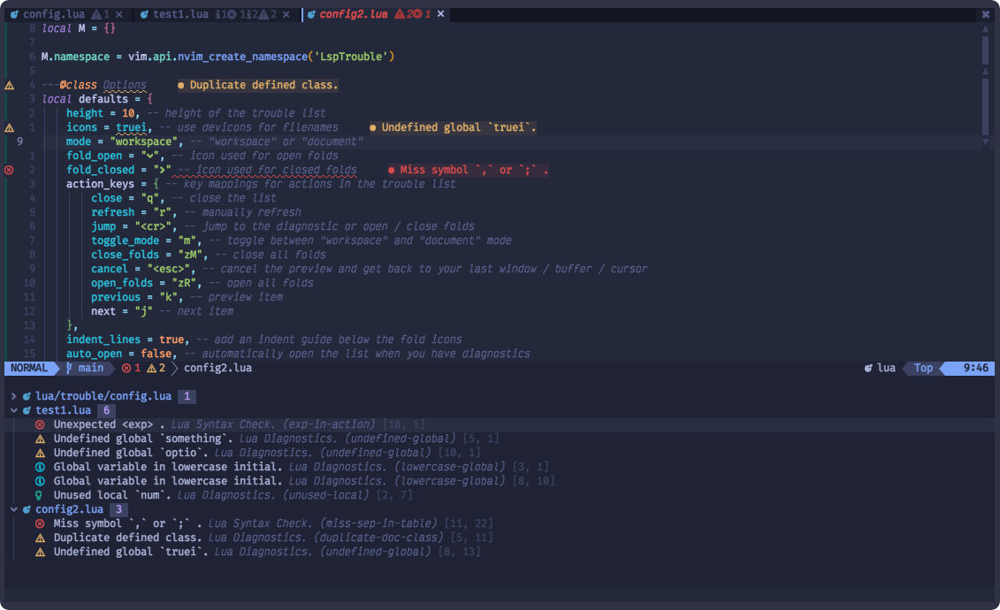

# 🚦 Trouble

A pretty list for showing diagnostics, references, telescope results, quickfix and location lists to help you solve all the trouble your code is causing.



## ✨ Features

- pretty list of:
  - Diagnostics
  - LSP references
  - LSP implementations
  - LSP definitions
  - LSP type definitions
  - quickfix list
  - location list
  - [Telescope](https://github.com/nvim-telescope/telescope.nvim) search results
- automatically updates on new diagnostics
- toggle **diagnostics** mode between **workspace** or **document**
- **interactive preview** in your last accessed window
- _cancel_ preview or _jump_ to the location
- configurable actions, signs, highlights,...

## ⚡️ Requirements

- Neovim >= 0.7.2
- Properly configured Neovim LSP client
- [nvim-web-devicons](https://github.com/nvim-tree/nvim-web-devicons) is optional to enable file icons
- a theme with properly configured highlight groups for Neovim Diagnostics
- or install 🌈 [lsp-colors](https://github.com/folke/lsp-colors.nvim) to automatically create the missing highlight groups
- a [patched font](https://www.nerdfonts.com/) for the default severity and fold icons

## 📦 Installation

Install the plugin with your preferred package manager:

### [lazy.nvim](https://github.com/folke/lazy.nvim)

```lua
return {
 "folke/trouble.nvim",
 dependencies = { "nvim-tree/nvim-web-devicons" },
 opts = {
  -- your configuration comes here
  -- or leave it empty to use the default settings
  -- refer to the configuration section below
 },
}
```

## ⚙️ Configuration

### Setup

Trouble comes with the following defaults:

```lua
{
    position = "bottom", -- position of the list can be: bottom, top, left, right
    height = 10, -- height of the trouble list when position is top or bottom
    width = 50, -- width of the list when position is left or right
    icons = true, -- use devicons for filenames
    mode = "workspace_diagnostics", -- "workspace_diagnostics", "document_diagnostics", "quickfix", "lsp_references", "loclist"
    severity = nil, -- nil (ALL) or vim.diagnostic.severity.ERROR | WARN | INFO | HINT
    fold_open = "", -- icon used for open folds
    fold_closed = "", -- icon used for closed folds
    group = true, -- group results by file
    padding = true, -- add an extra new line on top of the list
    cycle_results = true, -- cycle item list when reaching beginning or end of list
    action_keys = { -- key mappings for actions in the trouble list
        -- map to {} to remove a mapping, for example:
        -- close = {},
        close = "q", -- close the list
        cancel = "<esc>", -- cancel the preview and get back to your last window / buffer / cursor
        refresh = "r", -- manually refresh
        jump = {"<cr>", "<tab>"}, -- jump to the diagnostic or open / close folds
        open_split = { "<c-x>" }, -- open buffer in new split
        open_vsplit = { "<c-v>" }, -- open buffer in new vsplit
        open_tab = { "<c-t>" }, -- open buffer in new tab
        jump_close = {"o"}, -- jump to the diagnostic and close the list
        toggle_mode = "m", -- toggle between "workspace" and "document" diagnostics mode
        switch_severity = "s", -- switch "diagnostics" severity filter level to HINT / INFO / WARN / ERROR
        toggle_preview = "P", -- toggle auto_preview
        hover = "K", -- opens a small popup with the full multiline message
        preview = "p", -- preview the diagnostic location
        close_folds = {"zM", "zm"}, -- close all folds
        open_folds = {"zR", "zr"}, -- open all folds
        toggle_fold = {"zA", "za"}, -- toggle fold of current file
        previous = "k", -- previous item
        next = "j" -- next item
    },
    indent_lines = true, -- add an indent guide below the fold icons
    auto_open = false, -- automatically open the list when you have diagnostics
    auto_close = false, -- automatically close the list when you have no diagnostics
    auto_preview = true, -- automatically preview the location of the diagnostic. <esc> to close preview and go back to last window
    auto_fold = false, -- automatically fold a file trouble list at creation
    auto_jump = {"lsp_definitions"}, -- for the given modes, automatically jump if there is only a single result
    signs = {
      -- icons / text used for a diagnostic
      error = "",
      warning = "",
      hint = "",
      information = "",
      other = "",
    },
    use_diagnostic_signs = false -- enabling this will use the signs defined in your lsp client
}
```

> 💡 if you don't want to use icons or a patched font, you can use the settings below

```lua
-- settings without a patched font or icons
{
    icons = false,
    fold_open = "v", -- icon used for open folds
    fold_closed = ">", -- icon used for closed folds
    indent_lines = false, -- add an indent guide below the fold icons
    signs = {
        -- icons / text used for a diagnostic
        error = "error",
        warning = "warn",
        hint = "hint",
        information = "info"
    },
    use_diagnostic_signs = false -- enabling this will use the signs defined in your lsp client
}
```

## 🚀 Usage

### Commands

Trouble comes with the following commands:

- `Trouble [mode]`: open the list
- `TroubleClose [mode]`: close the list
- `TroubleToggle [mode]`: toggle the list
- `TroubleRefresh`: manually refresh the active list

Modes:

- **document_diagnostics:** document diagnostics from the builtin LSP client
- **workspace_diagnostics:** workspace diagnostics from the builtin LSP client
- **lsp_references:** references of the word under the cursor from the builtin LSP client
- **lsp_definitions:** definitions of the word under the cursor from the builtin LSP client

* **lsp_type_definitions:** type definitions of the word under the cursor from the builtin LSP client

- **quickfix:** [quickfix](https://neovim.io/doc/user/quickfix.html) items
- **loclist:** items from the window's [location list](https://neovim.io/doc/user/quickfix.html)

Example keybindings:

```vim
" Vim Script
nnoremap <leader>xx <cmd>TroubleToggle<cr>
nnoremap <leader>xw <cmd>TroubleToggle workspace_diagnostics<cr>
nnoremap <leader>xd <cmd>TroubleToggle document_diagnostics<cr>
nnoremap <leader>xq <cmd>TroubleToggle quickfix<cr>
nnoremap <leader>xl <cmd>TroubleToggle loclist<cr>
nnoremap gR <cmd>TroubleToggle lsp_references<cr>
```

```lua
-- Lua
vim.keymap.set("n", "<leader>xx", "<cmd>TroubleToggle<cr>",
  {silent = true, noremap = true}
)
vim.keymap.set("n", "<leader>xw", "<cmd>TroubleToggle workspace_diagnostics<cr>",
  {silent = true, noremap = true}
)
vim.keymap.set("n", "<leader>xd", "<cmd>TroubleToggle document_diagnostics<cr>",
  {silent = true, noremap = true}
)
vim.keymap.set("n", "<leader>xl", "<cmd>TroubleToggle loclist<cr>",
  {silent = true, noremap = true}
)
vim.keymap.set("n", "<leader>xq", "<cmd>TroubleToggle quickfix<cr>",
  {silent = true, noremap = true}
)
vim.keymap.set("n", "gR", "<cmd>TroubleToggle lsp_references<cr>",
  {silent = true, noremap = true}
)
```

### API

You can use the following functions in your keybindings:

```lua
-- jump to the next item, skipping the groups
require("trouble").next({skip_groups = true, jump = true});

-- jump to the previous item, skipping the groups
require("trouble").previous({skip_groups = true, jump = true});

-- jump to the first item, skipping the groups
require("trouble").first({skip_groups = true, jump = true});

-- jump to the last item, skipping the groups
require("trouble").last({skip_groups = true, jump = true});
```

### Telescope

You can easily open any search results in **Trouble**, by defining a custom action:

```lua
local actions = require("telescope.actions")
local trouble = require("trouble.providers.telescope")

local telescope = require("telescope")

telescope.setup {
  defaults = {
    mappings = {
      i = { ["<c-t>"] = trouble.open_with_trouble },
      n = { ["<c-t>"] = trouble.open_with_trouble },
    },
  },
}
```

When you open telescope, you can now hit `<c-t>` to open the results in **Trouble**

## 🎨 Colors

The table below shows all the highlight groups defined for Trouble.

| Highlight Group          |
| ------------------------ |
| _TroubleCount_           |
| _TroubleError_           |
| _TroubleNormal_          |
| _TroubleTextInformation_ |
| _TroubleSignWarning_     |
| _TroubleLocation_        |
| _TroubleWarning_         |
| _TroublePreview_         |
| _TroubleTextError_       |
| _TroubleSignInformation_ |
| _TroubleIndent_          |
| _TroubleSource_          |
| _TroubleSignHint_        |
| _TroubleSignOther_       |
| _TroubleFoldIcon_        |
| _TroubleTextWarning_     |
| _TroubleCode_            |
| _TroubleInformation_     |
| _TroubleSignError_       |
| _TroubleFile_            |
| _TroubleHint_            |
| _TroubleTextHint_        |
| _TroubleText_            |
