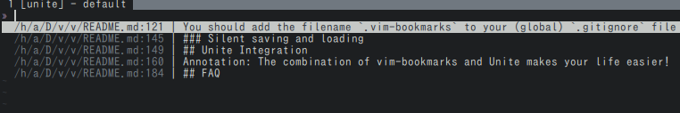
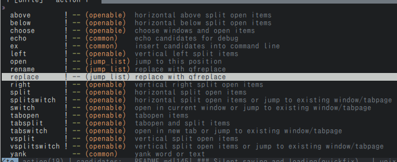

## vim-bookmarks [](https://travis-ci.org/MattesGroeger/vim-bookmarks) [](https://github.com/MattesGroeger/vim-bookmarks/releases) [](https://github.com/MattesGroeger/vim-bookmarks/issues)

This vim plugin allows toggling bookmarks per line. A quickfix window gives access to all bookmarks. Annotations can be added as well. These are special bookmarks with a comment attached. They are useful for preparing code reviews. All bookmarks will be restored on the next startup.


#### Bright Colors Example

[](https://raw.github.com/MattesGroeger/vim-bookmarks/master/screenshot-bright.png)

```viml
highlight BookmarkSign ctermbg=NONE ctermfg=160
highlight BookmarkLine ctermbg=194 ctermfg=NONE
let g:bookmark_sign = '♥'
let g:bookmark_highlight_lines = 1
```

### Features

* Toggle bookmarks per line ⚑
* Add annotations per line ☰
* Navigate all bookmarks with quickfix window
* Bookmarks will be restored on next startup
* [Bookmarks per working directory](https://github.com/MattesGroeger/vim-bookmarks#bookmarks-per-working-directory) (optional)
* Fully customisable (signs, sign column, highlights, mappings)
* Integrates with [Unite's](https://github.com/Shougo/unite.vim) quickfix source if installed
* Integrates with [ctrlp.vim](https://github.com/ctrlpvim/ctrlp.vim) if installed
* Works independently from [vim marks](http://vim.wikia.com/wiki/Using_marks)

## Installation

Before installation, please check your Vim supports signs by running `:echo has('signs')`.  `1` means you're all set; `0` means you need to install a Vim with signs support. If you're compiling Vim yourself you need the 'big' or 'huge' feature set. [MacVim][] supports signs.

Use your favorite plugin manager:

* [Pathogen][]
  * `git clone https://github.com/MattesGroeger/vim-bookmarks.git ~/.vim/bundle/vim-bookmarks`
* [Vundle][]
  1. Add `Plugin 'MattesGroeger/vim-bookmarks'` to .vimrc
  2. Run `:PluginInstall`
* [NeoBundle][]
  1. Add `NeoBundle 'MattesGroeger/vim-bookmarks'` to .vimrc
  2. Run `:NeoBundleInstall`
* [vim-plug][vimplug]
  1. Add `Plug 'MattesGroeger/vim-bookmarks'` to .vimrc
  2. Run `:PlugInstall`

## Usage

After installation you can directly start using it. You can do this by either using the default shortcuts or the commands:

| Action                                          | Shortcut    | Command                      |
|-------------------------------------------------|-------------|------------------------------|
| Add/remove bookmark at current line             | `mm`        | `:BookmarkToggle`            |
| Add/edit/remove annotation at current line      | `mi`        | `:BookmarkAnnotate <TEXT>`   |
| Jump to next bookmark in buffer                 | `mn`        | `:BookmarkNext`              |
| Jump to previous bookmark in buffer             | `mp`        | `:BookmarkPrev`              |
| Show all bookmarks (toggle)                     | `ma`        | `:BookmarkShowAll`           |
| Clear bookmarks in current buffer only          | `mc`        | `:BookmarkClear`             |
| Clear bookmarks in all buffers                  | `mx`        | `:BookmarkClearAll`          |
| Move up bookmark at current line                | `[count]mkk`| `:BookmarkMoveUp [<COUNT>]`  |
| Move down bookmark at current line              | `[count]mjj`| `:BookmarkMoveDown [<COUNT>]`|
| Move bookmark at current line to another line   | `[count]mg` | `:BookmarkMoveToLine <LINE>` |
| Save all bookmarks to a file                    |             | `:BookmarkSave <FILE_PATH>`  |
| Load bookmarks from a file                      |             | `:BookmarkLoad <FILE_PATH>`  |

You can change the shortcuts as you like, just read on...

## Customization

### Key Bindings

You can overwrite any of the default mappings. Just put the following into your `~/.vimrc` and adjust as you like:

```viml
nmap <Leader><Leader> <Plug>BookmarkToggle
nmap <Leader>i <Plug>BookmarkAnnotate
nmap <Leader>a <Plug>BookmarkShowAll
nmap <Leader>j <Plug>BookmarkNext
nmap <Leader>k <Plug>BookmarkPrev
nmap <Leader>c <Plug>BookmarkClear
nmap <Leader>x <Plug>BookmarkClearAll
nmap <Leader>kk <Plug>BookmarkMoveUp
nmap <Leader>jj <Plug>BookmarkMoveDown
nmap <Leader>g <Plug>BookmarkMoveToLine
```
You can disable all default key bindings by setting the following in your `~/.vimrc`:

```viml
let g:bookmark_no_default_key_mappings = 1
```

### Colors

Overwrite the default hightlight groups by adding this to your colorscheme or `.vimrc`:

```viml
highlight BookmarkSign ctermbg=whatever ctermfg=whatever
highlight BookmarkAnnotationSign ctermbg=whatever ctermfg=whatever
highlight BookmarkLine ctermbg=whatever ctermfg=whatever
highlight BookmarkAnnotationLine ctermbg=whatever ctermfg=whatever
```

### Options

Put any of the following options into your `~/.vimrc` in order to overwrite the default behaviour.

| Option                                         | Default                  | Description                                             |
|------------------------------------------------|--------------------------|---------------------------------------------------------|
| `let g:bookmark_sign = '>>'`                   | ⚑                        | Sets bookmark icon for sign column                      |
| `let g:bookmark_annotation_sign = '##'`        | ☰                        | Sets bookmark annotation icon for sign column           |
| `let g:bookmark_save_per_working_dir = 1`      | 0                        | Save bookmarks per working dir, the folder you opened vim from |
| `let g:bookmark_auto_save = 0`                 | 1                        | Enables/disables automatic saving for bookmarks         |
| `let g:bookmark_manage_per_buffer = 1`         | 0                        | Save bookmarks when leaving a buffer, load when entering one |
| `let g:bookmark_auto_save_file = '/bookmarks'` | $HOME .'/.vim-bookmarks' | Sets file for auto saving (ignored when `bookmark_save_per_working_dir` is enabled) |
| `let g:bookmark_auto_close = 1`                | 0                        | Automatically close bookmarks split when jumping to a bookmark |
| `let g:bookmark_highlight_lines = 1`           | 0                        | Enables/disables line highlighting                      |
| `let g:bookmark_show_warning = 0`              | 1                        | Enables/disables warning when clearing all bookmarks    |
| `let g:bookmark_show_toggle_warning = 0`       | 1                        | Enables/disables warning when toggling to clear a bookmark with annotation   |
| `let g:bookmark_center = 1`                    | 0                        | Enables/disables line centering when jumping to bookmark|
| `let g:bookmark_no_default_key_mappings = 1`                    | 0                        | Prevent any default key mapping from being created|
| `let g:bookmark_location_list = 1`             | 0                        | Use the location list to show all bookmarks             |
| `let g:bookmark_disable_ctrlp = 1`             | 0                        | Disable ctrlp interface when  show all bookmarks             |

### Bookmarks per working directory

This feature allows the grouping of bookmarks per root directory. This way bookmarks from other projects are not interfering. This is done by saving a file called `.vim-bookmarks` into the current working directory (the folder you opened vim from).

Whenever a vim instance is opened from the same root folder the bookmarks from that folder will be loaded. Note, that you can place your bookmarks in any file underneath the working directory, though.

In order to use this feature, put this into your `.vimrc`:

```viml
let g:bookmark_save_per_working_dir = 1
let g:bookmark_auto_save = 1
```

You should add the filename `.vim-bookmarks` to your (global) `.gitignore` file so it doesn't get checked into version control.

If you want to customize the location or filename you can define the following function in your `.vimrc`. The return value will be used to retrieve and save the bookmark positions. This way you can implement you custom strategy for determining the work dir location (e.g. inside the `.git` directory):

```viml
" Finds the Git super-project directory.
function! g:BMWorkDirFileLocation()
    let filename = 'bookmarks'
    let location = ''
    if isdirectory('.git')
        " Current work dir is git's work tree
        let location = getcwd().'/.git'
    else
        " Look upwards (at parents) for a directory named '.git'
        let location = finddir('.git', '.;')
    endif
    if len(location) > 0
        return location.'/'.filename
    else
        return getcwd().'/.'.filename
    endif
endfunction
```

### Bookmarks per buffer

This feature implies `bookmark_auto_save`. When configured bookmarks will be
loaded and saved on each buffer change. This allows working with different
buffers/tabs and keeping a different bookmark file for each one based on the
file open in the buffer. I.e., using the following function and having files
from different Git repositories open in different tabs will use a different
bookmarks file per Git repository.

This is different from how saving per working directory works because it allows
for having different bookmarks for different buffers/tabs open in the same
window without having the working directory change automatically when switching
between them.

The following function is similar to the one shown above (finds the .git folder
location, defaults to current file's directory) :
```viml
" Finds the Git super-project directory based on the file passed as an argument.
function! g:BMBufferFileLocation(file)
    let filename = 'vim-bookmarks'
    let location = ''
    if isdirectory(fnamemodify(a:file, ":p:h").'/.git')
        " Current work dir is git's work tree
        let location = fnamemodify(a:file, ":p:h").'/.git'
    else
        " Look upwards (at parents) for a directory named '.git'
        let location = finddir('.git', fnamemodify(a:file, ":p:h").'/.;')
    endif
    if len(location) > 0
        return simplify(location.'/.'.filename)
    else
        return simplify(fnamemodify(a:file, ":p:h").'/.'.filename)
    endif
endfunction
```

### Silent saving and loading

Call functions BookmarkSave, BookmarkLoad and BookmarkClearAll with the last argument set to 0 to perform these operations silently. You may use this to manage your bookmark list transparently from within your custom script.

## Unite Integration


[Unite](https://github.com/Shougo/unite.vim) is a multi-purpose user-interface plugin platform. Vim-bookmarks provides a Unite source called `vim_bookmarks` so users who use Unite will handle bookmarks with the Unite interface.

Additionally, when showing all your bookmarks, Unite is detected and the plugin will open `:Unite vim_bookmarks` instead of Vim's quickfix window. Note that `g:bookmark_auto_close` is no longer applied. Once opened, the window is managed by Unite.

To set a global per-source context setting, that will apply to Unite's vim_bookmarks source everytime it's opened, you can add this to your `vimrc`:

```viml
call unite#custom#profile('source/vim_bookmarks', 'context', {
	\   'winheight': 13,
	\   'direction': 'botright',
	\   'start_insert': 0,
	\   'keep_focus': 1,
	\   'no_quit': 1,
	\ })
```

With the Unite interface, when you select bookmarks, you can perform the following actions:

* Open the selected bookmarks in various ways (open to the right, open above, open in new tab, etc.)
* Yank the informations of selected bookmarks (path and line number, the line content, annotation, etc.)
* Highlight the lines of the selected bookmarks
* Replace the contents of selected bookmarks with [vim-qfreplace](https://github.com/thinca/vim-qfreplace) interface
* Delete the selected bookmarks
* And more...

See the screenshot below to get an idea of what you can do with the interface (the picture shows only a fraction, that means you can select even more actions):



For more information about Unite, start reading `:help Unite`.

## CtrlP Integration

[ctrlp.vim](https://github.com/ctrlpvim/ctrlp.vim) is a Full path fuzzy file, buffer, mru, tag, ... finder for Vim.

Additionally, when showing all your bookmarks, CtrlP is detected and the plugin will open `:CtrlPBookmark` instead of Vim's quickfix window. Note that `g:bookmark_auto_close` is no longer applied. Once opened, the window is managed by CtrlP.

With the CtrlP interface, when you select bookmarks, you can perform the following actions:
* Open the selected bookmarks in various ways (open to the right, open above, open in new tab, etc.)
* And more...

## FAQ

> Why are the colours in the sign column weird?

Your colorscheme is configuring the `SignColumn` highlight group weirdly. To change that add this to your `.vimrc`: `highlight SignColumn ctermbg=whatever`.

> What happens if I also use another plugin which uses signs (e.g. Syntastic)?

Vim only allows one sign per line. Therefore bookmarks will override any existing sign. When removing the bookmark the original sign will show up again. In other words vim-bookmarks won't remove another plugin's signs.

> Why aren't any signs showing at all?

Make sure your vim supports signs: `:echo has('signs')` should give `1`

> How do I avoid keybinding conflicts with the Nerdtree plugin?

You could unbind the keys whenever Nerdtree becomes active (thanks to [@Nitive](https://github.com/Nitive)).

```viml
let g:bookmark_no_default_key_mappings = 1
function! BookmarkMapKeys()
    nmap mm :BookmarkToggle<CR>
    nmap mi :BookmarkAnnotate<CR>
    nmap mn :BookmarkNext<CR>
    nmap mp :BookmarkPrev<CR>
    nmap ma :BookmarkShowAll<CR>
    nmap mc :BookmarkClear<CR>
    nmap mx :BookmarkClearAll<CR>
    nmap mkk :BookmarkMoveUp
    nmap mjj :BookmarkMoveDown
endfunction
function! BookmarkUnmapKeys()
    unmap mm
    unmap mi
    unmap mn
    unmap mp
    unmap ma
    unmap mc
    unmap mx
    unmap mkk
    unmap mjj
endfunction
autocmd BufEnter * :call BookmarkMapKeys()
autocmd BufEnter NERD_tree_* :call BookmarkUnmapKeys()
```

> Why do my bookmarks disappear when running the `:make` command?

By default, the bookmark list is shown using the quickfix window, which can sometimes conflict with other commands. The location list may be used to show the bookmark list instead by setting the `g:bookmark_location_list` option documented above.

## Changelog

See the [release page](https://github.com/MattesGroeger/vim-bookmarks/releases) for all changes.

## Credits & Contribution

This plugin was developed by [Mattes Groeger][blog] under the [MIT License][license]. Pull requests are very welcome.

The following plugins were a great inspiration to me:
* [vmark.vim][vmark] by Michael Zhou
* [vim-gitgutter][gitgutter] by Andrew Stewart


  [pathogen]: https://github.com/tpope/vim-pathogen
  [vundle]: https://github.com/gmarik/vundle
  [neobundle]: https://github.com/Shougo/neobundle.vim
  [vimplug]: https://github.com/MattesGroeger/vim-plug
  [macvim]: http://code.google.com/p/macvim/
  [license]: https://github.com/MattesGroeger/vim-bookmarks/blob/master/LICENSE
  [blog]: http://blog.mattes-groeger.de
  [vmark]: http://www.vim.org/scripts/script.php?script_id=4076
  [gitgutter]: https://github.com/airblade/vim-gitgutter
