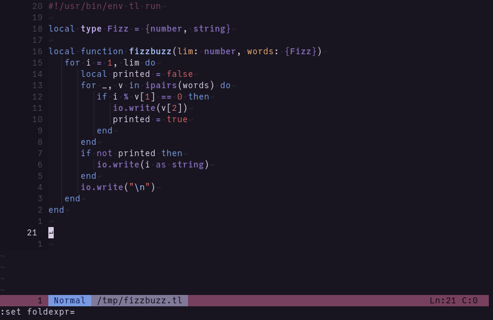

# vim-teal
This plugin provides [Teal](https://github.com/teal-language/tl) language support for Vim.



## Features

- Syntax highlighting
- Automatic indentation
- Linting (requires [ALE](https://github.com/dense-analysis/ale))
- Automatic insertion of `end` tokens (requires [vim-endwise](https://github.com/tpope/vim-endwise))
- `:compiler` support

## Install
Using [vim-plug](https://github.com/junegunn/vim-plug):
```vim
" Teal language support
Plug 'teal-language/vim-teal'

" Optional dependencies; will be loaded on-demand when editing Teal files
Plug 'dense-analysis/ale', { 'for': 'teal' }
Plug 'tpope/vim-endwise', { 'for': 'teal' }
```

You should also make sure that the Teal compiler [is available in your PATH:](https://github.com/teal-language/tl#installing)
```
luarocks install tl
```

## Contributors

Contributions are greatly appreciated! Feel free to fork [this repository](https://github.com/teal-language/vim-teal) and open a pull request on GitHub.
